<p align="center">
  <picture>
    <source media="(prefers-color-scheme: dark)" srcset="media/wordmark-dark.png">
    
  </picture>
</p>

<h3 align="center">Turn a startup idea into a landing page that asks for money<br>and doesn't look like an AI made it.</h3>

<p align="center">
  <a href="https://levimackay.github.io/first-dollar/gallery/"><b>Live gallery</b></a> ·
  <a href="#install">Install</a> ·
  <a href="#how-it-works">How it works</a> ·
  <a href="#the-ask">The ask</a> ·
  <a href="#what-it-refuses-to-ship">What it refuses to ship</a> ·
  <a href="#evals">Evals</a> ·
  <a href="#motion">Motion</a>
</p>

<p align="center">
  <a href="https://github.com/levimackay/first-dollar/actions/workflows/ci.yml"></a>
  <a href="LICENSE"></a>
  
  
</p>

<picture>
  <source media="(prefers-color-scheme: dark)" srcset="media/readme/hero-dark.png">
  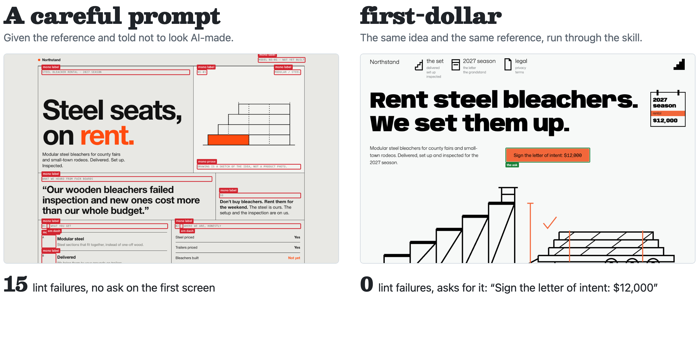
</picture>

<p align="center"><sub>One of the eval runs, rendered as built. Every eval number on this page comes from <a href="evals/results.json"><code>evals/results.json</code></a>.</sub></p>

## What it is

first-dollar is an agent skill for founders who want to know whether anyone will pay before they build. You give it an idea. It writes the brief and the copy, takes its look from a site you like, builds the page, and checks it with a 46-rule lint and a real browser.

The page has one button, and that button asks for money: a pre-order, a deposit, a paid pilot or a signed letter of intent. A free waitlist costs the visitor nothing, so even a long one can't tell "nice idea" from "I'll pay". A $40 deposit can.

Anything you haven't told it shows up on the page as a marked gap, like `[NEED: refund terms]`, and in a list of what you still owe. The skill fills gaps with markers instead of made-up facts, numbers or quotes.

## Install

Any agent the [skills CLI](https://skills.sh) supports:

```bash
npx skills add levimackay/first-dollar
```

Or as a Claude Code plugin:

```text
/plugin marketplace add levimackay/first-dollar
/plugin install first-dollar@first-dollar
```

The lint needs Node 20 or newer. The browser check also needs Chrome (or Playwright's Chromium). When neither is there, it says so and reports those checks as not verified, never as passed.

Then send your agent this:

```text
Use first-dollar to build a landing page for my idea.
Idea: <one sentence>
Who buys: <the person who pays>
The ask and its price: <a $40 deposit, a $1,500 pilot, ...>
Reference: <a site whose look you like>
```

No reference handy? It shows you three from a list of real sites and you pick a number.

## How it works

<picture>
  <source media="(prefers-color-scheme: dark)" srcset="media/readme/stages-dark.png">
  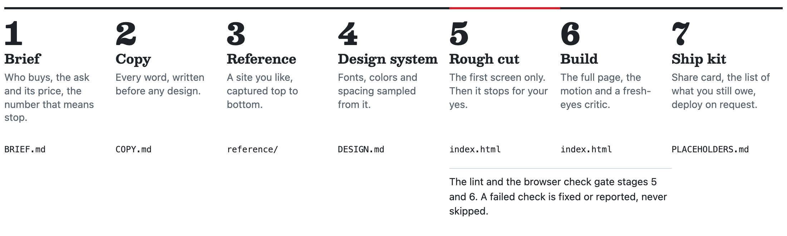
</picture>

It runs straight through except for two stops: picking a reference (only if you didn't give one) and the rough cut, where it shows you the first screen before building the rest.

The look comes from your reference, and it's measured. The browser check samples the reference's colors from its pixels and fails the page if its ground drifts from them. Fonts are matched by setting candidate faces in your own headline. The lint fails any face in the 200 most popular Google Fonts, and any face one of your last ten builds already used, so your pages don't drift into one shared look.

## The ask

The price decides what the button asks for.

| Price of the real product | The ask | The button says |
|---|---|---|
| Under about $100 | A pre-order, or the first period paid up front | `Pre-order for $36` |
| About $100 to $1,000 | A fixed deposit | `Reserve with a $40 deposit` |
| Over about $1,000, or a sale that needs a call | A paid pilot or a signed letter of intent | `Start the pilot for $1,500` |

Before any copy, the brief sets a kill number: the count of paid sign-ups below which you stop and don't build. It's written down before the page goes live, so the result can't be talked around later.

## What it refuses to ship

Forty-six rules, each one a pattern people now read as "an AI made this", each with a fix. A sample:

| Where | What fails |
|---|---|
| Type | Default and top-200 fonts, a face you used in your last ten builds, a flat type scale, paragraphs set in mono, an uppercase mono label over every heading |
| Color | Indigo and violet stock palettes, gradient text, glow shadows, radial gradients and blurred orbs |
| Layout | The centered eyebrow-headline-two-buttons hero, three cards in a row, cards in cards, colored side stripes, a row of big numbers, borrowed logo rows, one radius on everything |
| Copy | Buzzwords, the "not X, but Y" frame, em dashes, numbers nothing backs up, invented testimonials, text lifted from the reference |
| Motion | Bounce easing, pulsing dots, images that zoom on hover, `transition: all` |
| Placeholders | A photo placeholder in the hero, more than two on a page, captions that describe the page instead of the product, a gap marker in one of the page's own colors |
| The ask | A button that asks for nothing real, no price on it, no privacy or terms page |

This is the lint's real output on the left page in the picture above, trimmed:

```text
FAIL index.html:69  [mono-eyebrow] 7 headings each led by an uppercase mono micro-label; keep at most 2
FAIL index.html:85  [mono-prose] running text set in monospace reads as machine-made; use the text face
FAIL index.html:98  [em-dash] em dash in copy; rewrite the sentence
FAIL index.html:1   [legal-links] no privacy or terms link in any page
```

The browser check renders every page at 320 to 1920 pixels wide and fails on horizontal overflow, console errors, text left hidden after its reveal (including text stuck below a line mask), low contrast, a button label that wraps, an ask below the first phone screen, a ground that drifted from the reference, and anything that breaks under reduced motion. The full list, with every fix, is in [`slop-rules.md`](skills/first-dollar/references/slop-rules.md).

## Evals

Six fictional ideas, each built three ways by a fresh agent: a **plain** agent given just the idea, a **prompted** agent also given the reference and told not to look AI-made and to ask for the price, and **first-dollar**.

<!-- evals:start -->
| | plain | prompted | first-dollar |
|---|---|---|---|
| Lint failures, all six pages | 11 | 34 | 0 |
| Main button asks for money | 3 of 6 | 5 of 6 | 6 of 6 |
| Pages failing a browser check | 1 of 6 | 2 of 6 | 0 of 6 |
| Different headline fonts across the six | 2 | 5 | 6 |
<!-- evals:end -->

Read this with one caveat: the lint is first-dollar's own tool and the skill runs it while building, so its zero is by construction; that row shows what a stock agent ships without it. The other rows are the honest comparison. Every page is kept as built, the stock agents' losses included: per-page rows and the method are in [`evals/results.md`](evals/results.md), and every page is in [`evals/runs`](evals/runs).

## Gallery

Every page below is live in the [gallery](https://levimackay.github.io/first-dollar/gallery/), next to the prompted agent's version of the same idea. All six pages first-dollar built for the fictional eval ideas, none left out. Gaps like `[NEED: product name]` are facts the made-up founder never gave, and the hatched boxes are where their photos go.

<table>
  <tr>
    <td width="33%">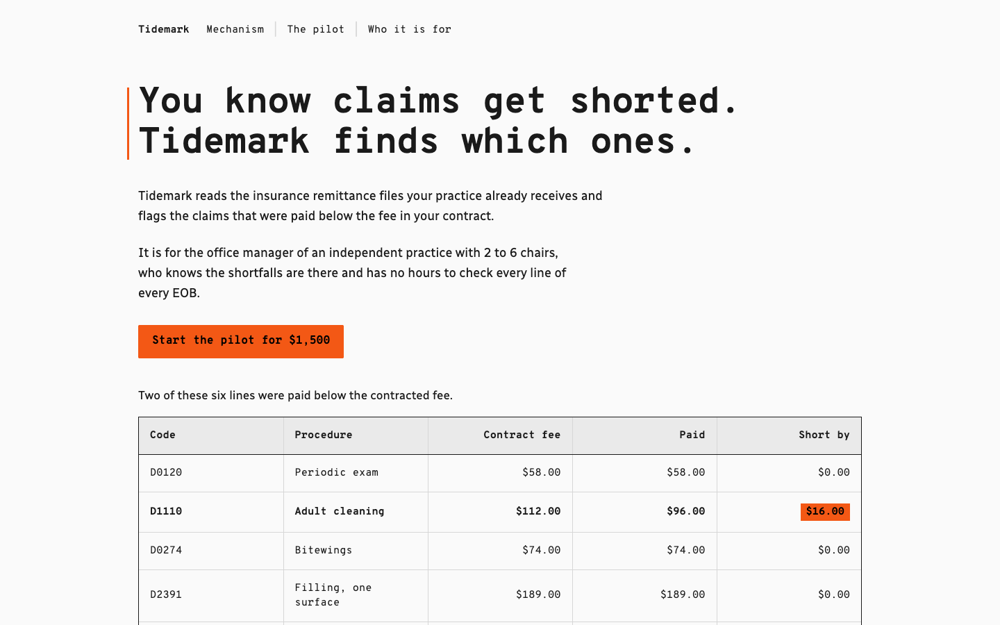<br><b>Tidemark</b>, a $1,500 paid pilot. From planetscale.com.</td>
    <td width="33%">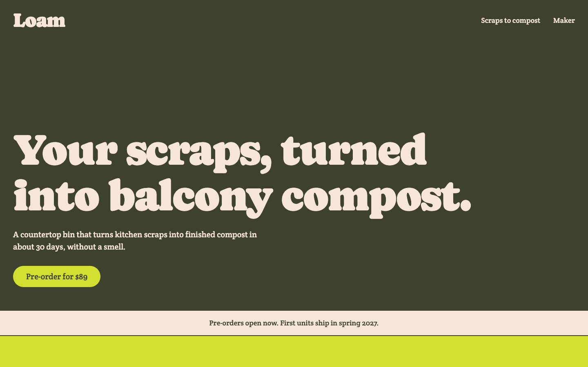<br><b>Loam</b>, an $89 pre-order. From graza.co.</td>
    <td width="33%">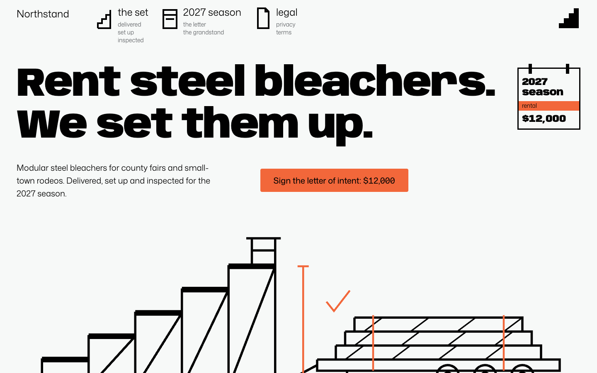<br><b>Northstand</b>, a $12,000 letter of intent. From teenage.engineering.</td>
  </tr>
  <tr>
    <td width="33%">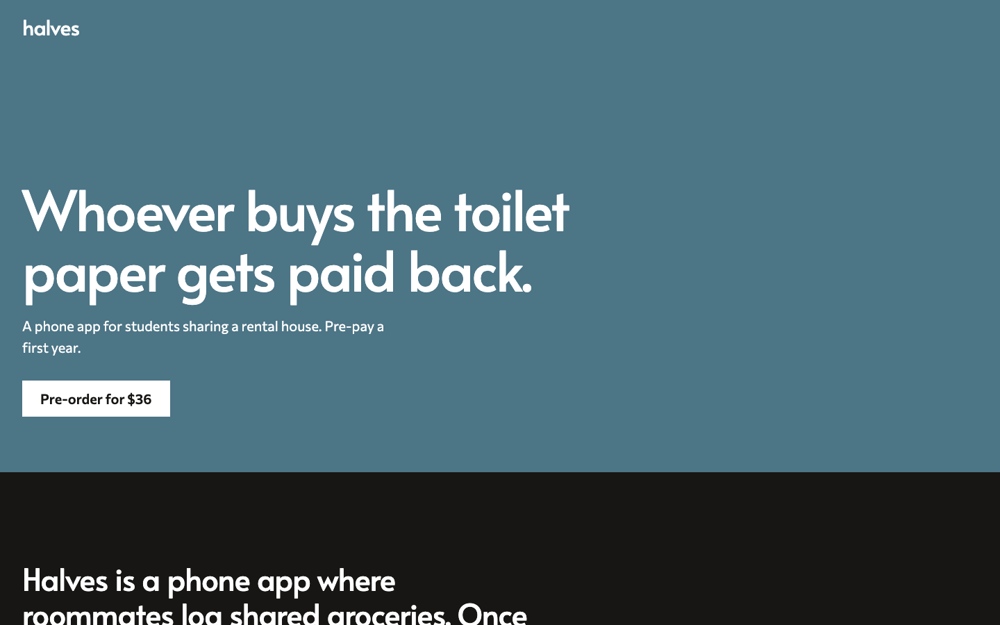<br><b>Halves</b>, a $36 pre-order. From thelightphone.com.</td>
    <td width="33%">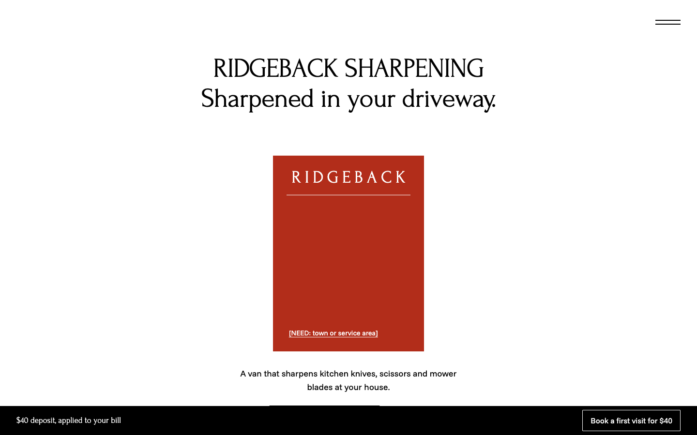<br><b>Ridgeback Sharpening</b>, a $40 first visit. From kinfolk.com.</td>
    <td width="33%">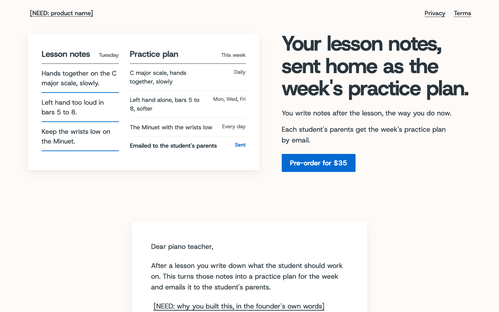<br><b>A practice-plan tool</b>, a $35 pre-order, from one sentence. From basecamp.com.</td>
  </tr>
</table>

## Motion

Every page gets one signature motion that shows how the product works, sized to how loud the reference is. A quiet reference gets it once, slowly; a loud one may get two supporting moves. Twelve recipes ship with the skill, each one file that works pasted alone and shows its final state with reduced motion or no script. A few:

<table>
  <tr>
    <td width="33%">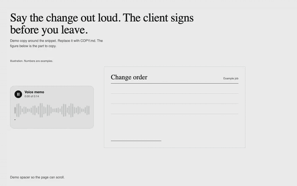<br><b>mechanism-sequence</b><br>Input, process, output, played once inside the product.</td>
    <td width="33%">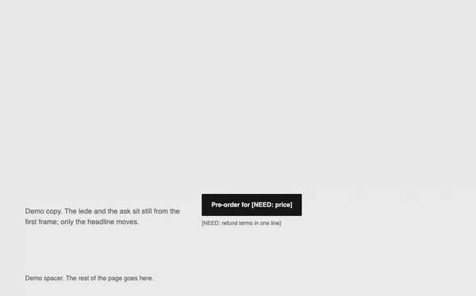<br><b>split-line-reveal</b><br>The headline rises line by line out of its own mask.</td>
    <td width="33%"><br><b>pinned-mask-reveal</b><br>A held section opens on the thing you'll actually get.</td>
  </tr>
  <tr>
    <td width="33%">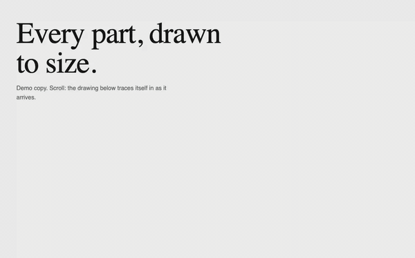<br><b>stroke-draw</b><br>A line drawing draws itself, for references that draw.</td>
    <td width="33%">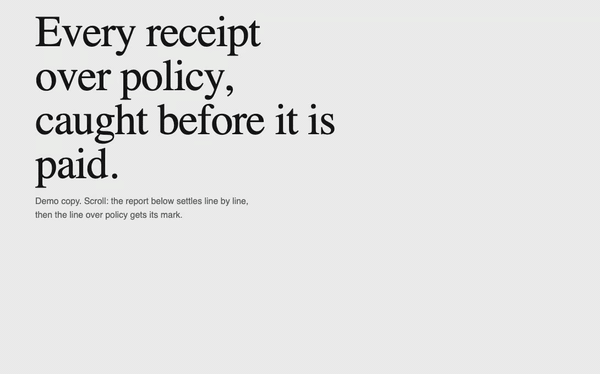<br><b>spring-settle</b><br>Rows settle into a list, and the one that matters gets its mark.</td>
    <td width="33%">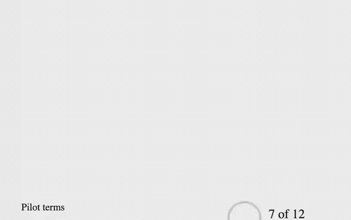<br><b>ring-fill</b><br>A ring fills to a real count, only when the founder gave one.</td>
  </tr>
</table>

Seven recipes are plain JavaScript. Five load [Motion](https://motion.dev) from a pinned CDN URL. None count numbers up, and none ever move the button that asks for money.

## What's in the repo

```text
skills/first-dollar/     the skill: SKILL.md, references, templates, motion recipes,
                         and the two bundled scripts (no npm install needed)
src/                     the lint rules and browser checks the scripts are built from
test/                    343 tests, with failing and passing fixtures for the rules
evals/                   the six cases, every page built for them, and the scores
scripts/readme-media.mjs rebuilds every image on this page from evals/
```

## Credits

first-dollar combines ideas from hallmark, Google's DESIGN.md format, impeccable, taste-skill, ui-taste and others, each credited in [`CREDITS.md`](CREDITS.md) with what was taken and under which license.

## License

[MIT](LICENSE) © Levi Mackay
